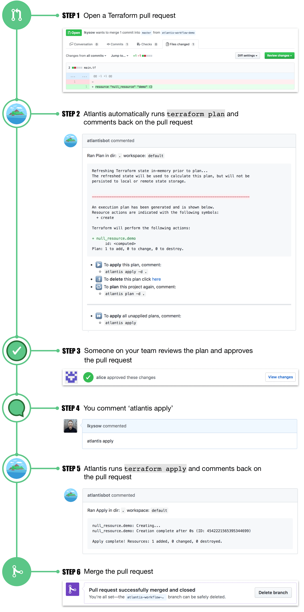

### What is Terraform?


Terraform is a tool for building, changing, and versioning infrastructure safely and efficiently. Terraform can manage existing and popular service providers as well as custom in-house solutions.

Configuration files describe to Terraform the components needed to run a single application or your entire datacenter. Terraform generates an execution plan describing what it will do to reach the desired state, and then executes it to build the described infrastructure. As the configuration changes, Terraform is able to determine what changed and create incremental execution plans which can be applied.

The infrastructure Terraform can manage includes low-level components such as compute instances, storage, and networking, as well as high-level components such as DNS entries, SaaS features, etc.

#### Why use terraform?

* Cloud-agnostic provisioning
* Supports immutable infrastructure
* Declarative language
* Masterless and agentless architecture
* Large community
* Mature enough codebase

_Table 1. Comparison of the most common way to use the most popular IAC tools_
|Tool|Source|Cloud|Type|Infrastructure|Language|Agent|Master|Community|Maturity|
|---|---|---|---|---|---|---|---|---|---|
|Chef|Open|All|Config Mgmt|Mutable|Procedural|Yes|Yes|Large|High|
|Puppet|Open|All|Config Mgmt|Mutable|Declarative|Yes|Yes|Large|High|
|Ansible|Open|All|Config Mgmt|Mutable|Procedural|No|No|Large|Medium|
|SaltStack|Open|All|Config Mgmt|Mutable|Declarative|Yes|Yes|Medium|Medium|
|CloudFormation|Closed|AWS|Provisioning|Immutable|Declarative|No|No|Small|Medium|
|Heat|Open|All|Provisioning|Immutable|Declarative|No|No|Small|Low|
|Terraform|Open|All|Provisioning|Immutable|Declarative|No|No|Medium|Low|

[Gruntwork - Why use terraform?](https://www.oreilly.com/content/why-use-terraform/)

### How to Install Terraform?

For Mac users:   
```
brew tap hashicorp/tap
brew install hashicorp/tap/terraform
```

To upgrade to latest:
```
brew upgrade hashicorp/tap/terraform
```

For other platforms:
* [Terraform installation](https://learn.hashicorp.com/tutorials/terraform/install-cli?in=terraform/aws-get-started)

#### Verify the installation

```
terraform -help
Usage: terraform [-version] [-help] <command> [args]

The available commands for execution are listed below.
The most common, useful commands are shown first, followed by
less common or more advanced commands. If you're just getting
started with Terraform, stick with the common commands. For the
other commands, please read the help and docs before usage.
```

#### Links

* [Introduction to Terraform](https://www.terraform.io/intro/index.html)
* [Tutorials](https://learn.hashicorp.com/collections/terraform/aws-get-started)
* [Reference](https://www.terraform.io/docs/configuration/index.html)
* [Providers](https://registry.terraform.io/browse/providers)
* [Registry](https://registry.terraform.io/)

#### Companies

* [Hashicorp](https://www.hashicorp.com/)
* [Cloud Posse](https://github.com/cloudposse)
* [Gruntwork](https://gruntwork.io/)

#### Communities

* [Cloud Posse](https://github.com/cloudposse)

#### Articles

* [Gruntwork - Why use terraform?](https://www.oreilly.com/content/why-use-terraform/)
* [Ansible Terraform Better Together](https://www.hashicorp.com/resources/ansible-terraform-better-together)
* [Ansible vs Terraform vs Puppet: Which to Choose?](https://phoenixnap.com/blog/ansible-vs-terraform-vs-puppet#:~:text=Terraform%20performs%20better%20when%20it,designing%20IAC%20environments%20for%20automation.)

---
### What is Terragrunt?


Terragrunt is a thin wrapper that provides extra tools for keeping your configurations DRY, working with multiple Terraform modules, and managing remote state.

__Benefits__:

* Explicit dependencies: Share your state easily
* Automatic Atlantis config generation: Eliminates toil
* Environment variable support: Discourages hard-coded values
* Generate blocks: Remove repeated Terraform
* Automatic resource tagging: Applies metadata universally
* Arbitrary command output from variables: Streamlines library usage
* read_terragrunt_config imports: Eliminate repeated Terragrunt code

<br>

Best practice in Terragrunt encourages module reusability and extensibility by default: it forces us to make the kinds of good technical decisions that uphold our security and development principles  

<br>


### How to Install Terragrunt?

For Mac users:   
```
brew update
brew install terragrunt
```

For other platforms:
* [Terragrunt installation](https://terragrunt.gruntwork.io/docs/getting-started/install/)

#### Links
* [Features](https://terragrunt.gruntwork.io/docs/#features)
* [Getting Started](https://terragrunt.gruntwork.io/docs/#getting-started)
* [Reference](https://terragrunt.gruntwork.io/docs/#reference)

---
### What is GitOps?


GitOps is a way of implementing Continuous Deployment for cloud native applications. It focuses on a developer-centric experience when operating infrastructure, by using tools developers are already familiar with, including Git and Continuous Deployment tools.

The core idea of GitOps is having a Git repository that always contains declarative descriptions of the infrastructure currently desired in the production environment and an automated process to make the production environment match the described state in the repository. If you want to deploy a new application or update an existing one, you only need to update the repository - the automated process handles everything else. It’s like having cruise control for managing your applications in production.

[For more information https://www.gitops.tech/](https://www.gitops.tech/)

### Push-based Deployments

The Push-based deployment strategy is implemented by popular CI/CD tools such as Jenkins, CircleCI, or Travis CI. The source code of the application lives inside the application repository along with the Kubernetes YAMLs needed to deploy the app. Whenever the application code is updated, the build pipeline is triggered, which builds the container images and finally the environment configuration repository is updated with new deployment descriptors.

Tip: You can also just store templates of the YAMLs in the application repository. When a new version is built, the template can be used to generate the YAML in the environment configuration repository.


### Pull-based Deployments

The Pull-based deployment strategy uses the same concepts as the push based variant but differs in how the deployment pipeline works. Traditional CI/CD pipelines are triggered by an external event, for example when new code is pushed to an application repository. With the pull-based deployment approach, the operator is introduced. It takes over the role of the pipeline by continuously comparing the desired state in the environment repository with the actual state in the deployed infrastructure. Whenever differences are noticed, the operator updates the infrastructure to match the environment repository. Additionally the image registry can be monitored to find new versions of images to deploy.


---
### Atlantis - Terraform Pull Request Automation


Atlantis is a tool for collaborating on Terraform. The core functionality of Atlantis enables developers and operators to run terraform plan and apply directly from Terraform pull requests. Atlantis then comments back on the pull request with the output of the commands.

[Atlantis Web Page](https://www.runatlantis.io)



### Links

* [Getting Started](https://www.runatlantis.io/guide/)
* [Installation](https://www.runatlantis.io/docs/installation-guide.html)
* [Documentation](https://www.runatlantis.io/docs/)
### Articles about using Terragrunt, Terraform and Atlantis for GitOps

* [Transcend](https://transcend.io/blog/why-we-use-terragrunt) - Enhancing the Terraform Experience: Why we use Terragrunt
* [Hootsuite](https://medium.com/runatlantis/introducing-atlantis-6570d6de7281) - Introducing Atlantis


---

### Other Tools

* [ArgoCD:](https://argoproj.github.io/argo-cd/) A GitOps operator for Kubernetes with a web interface
* [Flux:](https://github.com/fluxcd/flux) The GitOps Kubernetes operator by the creators of GitOps — Weaveworks
* [Gitkube:](https://gitkube.sh/) A tool for building and deploying docker images on Kubernetes using git push
* [JenkinsX:](https://jenkins-x.io/) Continuous Delivery on Kubernetes with built-in GitOps
* [WKSctl:](https://github.com/weaveworks/wksctl) A tool for Kubernetes cluster configuration management based on GitOps principles
* [Helm Operator:](https://github.com/fluxcd/helm-operator) An operator for using GitOps on K8s with Helm
* [werf:](https://werf.io/) A CLI tool to build images and deploy them to Kubernetes via push-based approach

Click [https://gitops.tech](https://www.gitops.tech/) for more information (tools, talks, blog posts and articles) 
