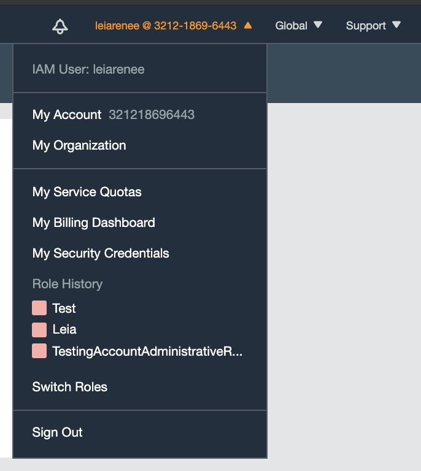
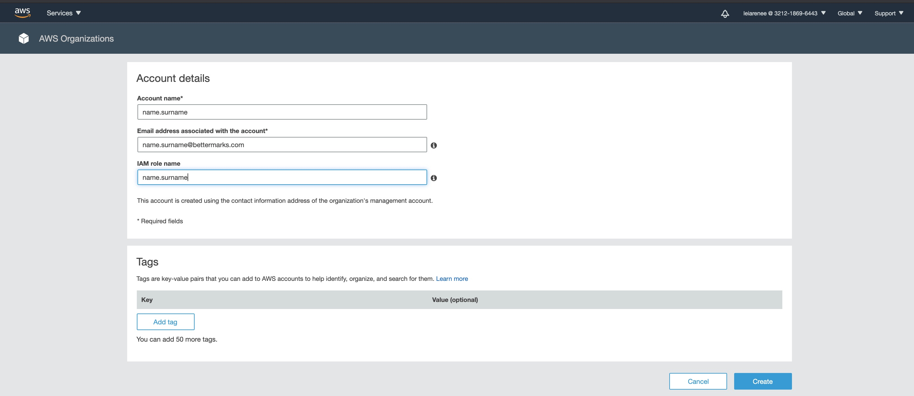

### AWS Account Setup

#### How to create an AWS organization account?

* [Goto Create AWS Account](https://console.aws.amazon.com/organizations/home#/accounts/add/create) 
  * Or:
  * From right top menu <name.surname>@321218696443 choose `My Organization`
  * 
  * Press `Àdd Account` Button
  * Choose `Create Account`
* Fill the form
  * Account name  : <name.surname> (small)
  * Email address associated with the account : <name.surname>@bettermarks.com
  * IAM role name : <name.surname> (small)
* Press `Create`

